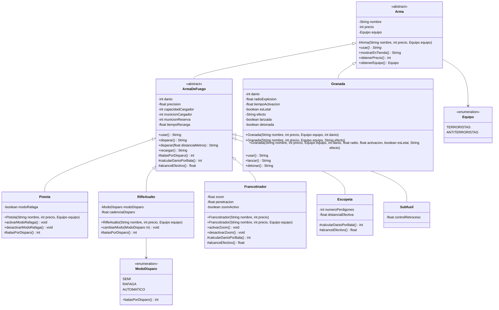

# jb-taller-git-2026

Servicio REST en Spring Boot (Java 21) con el modelado de armas de **Counter-Strike 2**.
Lenguaje de Programación 3 (CYT646) — Universidad Católica «Nuestra Señora de la Asunción».
Autor: Joaquín Benegas ([@joaquinBenegas0](https://github.com/joaquinBenegas0)).

**Licencia:** [Apache License 2.0](LICENSE).

## Cómo ejecutarlo

```
./mvnw spring-boot:run
```

| Endpoint | Qué hace |
|---|---|
| `GET /` | Confirma que el servicio está vivo |
| `GET /api/armas/francotirador?nombre=AWP&precio=4750&distancia=300` | Construye con el constructor sobrecargado `(nombre, precio, equipo)` y muestra `disparar()` y `disparar(distancia)` |
| `GET /api/armas/francotirador/personalizado?nombre=Scout&precio=1700&equipo=TERRORISTAS&danio=74&precision=0.9&cargador=10&reserva=90&recarga=2.9&zoom=2&penetracion=0.3` | Construye con el constructor completo |
| `GET /api/armas/inventario` | Le pide `usar()` a cada arma tratándola como `Arma` |

Si un valor rompe una regla (por ejemplo `precio=0` o `distancia=-5`), la clase lo rechaza y el servicio responde `400` con el mensaje.

## Paquetes

Siguen el [template de la cátedra](https://github.com/alefq/lp3-template-tp/tree/main/src/main/java/py/edu/uc/lp3):

```
src/main/java/py/edu/uc/lp3/
├── Application.java        solo arranca el servicio
├── constants/ApiPaths.java rutas de la API
├── domain/                 modelo de CS2 (reglas del juego)
└── rest/controller/        servicios REST (entrada HTTP)
```

## Diagrama de clases



Cada clase hija conserva además su constructor completo (todos los valores), que llama a `super`.

## Sobrecarga y sobreescritura

**Sobrecarga** (misma clase, mismo nombre, otra lista de argumentos; Java elige la versión al compilar según los argumentos):

- **Constructores:** `Francotirador(nombre, precio)`, `Francotirador(nombre, precio, equipo)` y el completo; `RifleAsalto` y `Pistola` suman `(nombre, precio, equipo)`; `Granada(…, int danio)` arma una granada explosiva y `Granada(…, String efecto)` una táctica no letal. Las versiones cortas encadenan con `this(...)` hasta el constructor completo, que llama a `super` y valida: toda firma deja el objeto en un estado legal.
- **Mensaje del dominio:** `ArmaDeFuego.disparar()` y `ArmaDeFuego.disparar(float distanciaMetros)`. Es la misma acción; la segunda indica la distancia y, si supera el alcance efectivo, el daño cae en proporción. Las dos pasan por un único método privado que descuenta munición, así que ninguna puede saltarse esa regla.

**Sobreescritura** (misma firma en la clase hija, implementación propia; Java elige la versión al ejecutar según el objeto real):

- `Arma.usar()` es **abstracto**: el padre no puede resolverlo porque cada tipo se usa distinto. Lo sobreescriben dos hijas independientes: `ArmaDeFuego.usar()` dispara y `Granada.usar()` se lanza. `InventarioController` recorre una `List<Arma>` y llama a `usar()` sin ningún `if` por tipo.
- `alcanceEfectivo()` (nuevo): `ArmaDeFuego` define 50 m; `Escopeta` lo sobreescribe con su distancia efectiva y `Francotirador` lo multiplica por el zoom llamando a `super`.
- `balasPorDisparo()` (`Pistola`, `RifleAsalto`) y `calcularDanioPorBala()` (`Francotirador`, `Escopeta`) siguen especializando el disparo.

En resumen: la sobrecarga cambia **qué argumentos** recibe un mensaje dentro de una clase; la sobreescritura cambia **cómo responde** cada tipo al mismo mensaje.

## ¿Qué pasa si el controller asigna a mano la munición?

No compila: `municionCargador`, `municionReserva` y el resto del estado son `private` y no hay setters. La munición solo cambia por `disparar()` y `recargar()`, que son `final` en `ArmaDeFuego`. Los valores iniciales pasan por constructores que rechazan valores ilegales con `IllegalArgumentException`, y el controller solo traduce ese rechazo a un `400`.

## Bitácora de IA

Ver [BITACORA.md](BITACORA.md).
