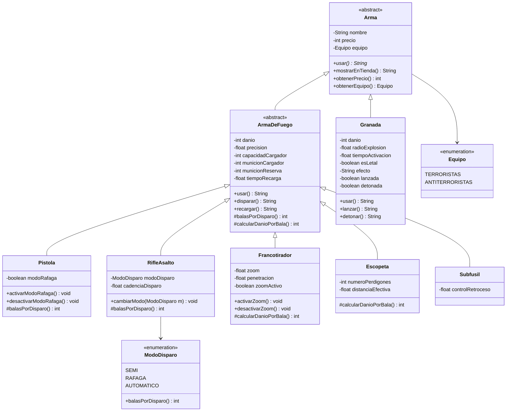

# jb-taller-git-2026
Servicio REST en Spring Boot (Java 21) con el modelado de armas de **Counter-Strike 2**.
Taller de Git y POO — Lenguaje de Programación 3 (CYT646).

## Cómo ejecutarlo

```
./mvnw spring-boot:run
```

- `GET /` → estado del servicio
- `GET /api/armas/francotirador?nombre=AWP&precio=4750` → construye un francotirador con parámetros de la URL
- `GET /api/armas/inventario` → cada arma del inventario se usa a través del tipo padre `Arma`

## Diagrama de clases


